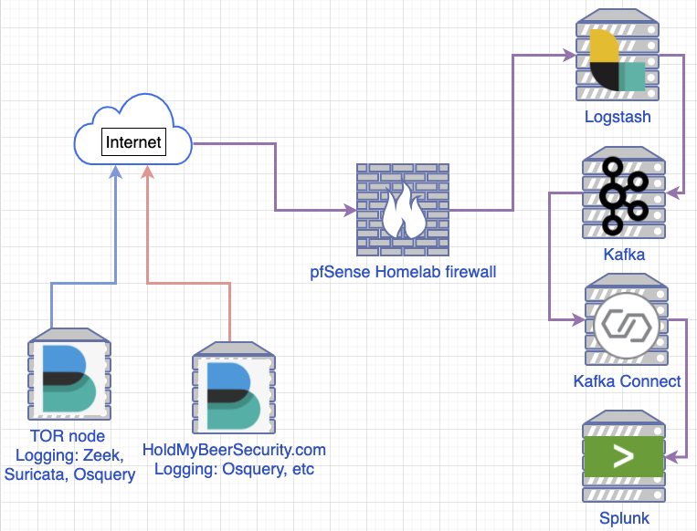

# Logging pipeline

## Network diagram
<p align="center">
  
</p>

## .env
The Docker images are pinned to the following version below. If you want a different version please update `.env`
```
CONFLUENT_VERSION=5.5.0
LOGSTASH_VERSION=7.6.2
ROOT_LOGLEVEL=ERROR
SPLUNK_VERSION=splunk:8.0-debian
```

## Build pipeline
1. `docker-compose build`
1. `docker-compose up -d`

## Create Splunk index


## Create Splunk HEC input

## Init Kafka-connector with Python script
1. `pip3 install -U requests`
1. 
```
```

## References
* []()